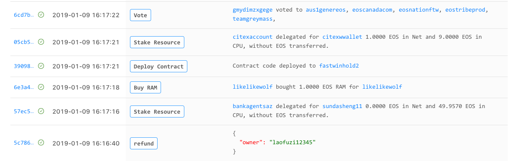
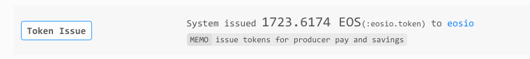

# EOS-Semantics
> Makes your EOS contracts action data understandable, by human.



## Why
由于 EOS 合约的复杂性，普通用户很难理解链上发生了什么。Dapp 开发者也经常被用户质疑链上数据的含义。

EOS Semantics 的出现，可以让普通用户也可以理解合约数据，降低普通用户的参与门槛，从而提高 Dapp 的活跃度。

[EOSPark](https://eospark.com) 是第一个提出并实现合约语义化的区块链浏览器。最初只应用于系统合约，获得了用户的广泛好评。现在将其语义化能力开放出来，进一步服务于广大合约开发者。

## How
EOS Semantics 的基本原理类似于李嘉图合约，即将合约 action 的数据通过一个 template 渲染成人类可读的自然语言。除此之外，EOS Semantics 提供了更多更为强大的功能，例如账号、合约跳转，代码高亮，多语言等等。

以 EOS 系统合约 eosio.token 的 issue action 为例，其合约数据为:
```json
{
  "data": {
    "quantity": "1.0000 EOS",
    "to": "supereospark",
    "memo": "Good job EOS Semantics"
  }
}
```

则对应需要提供的语义化信息结构如下：
```json
{
    "issue": {
        "actionName": "Issue Token",
        "template": "System issued <Token :quantity="quantity" contract="eosio.token"/> to <Account :to="to" /> <Memo>{{memo}}</Memo>"
    }
}
```

最终会渲染出如下结构:




## Contribution
1. Clone
```
git clone https://github.com/BlockABC/eos-semantics
cd eos-semantics
```

2. 增加语义化信息

    2.1 在 [Playground](https://eospark.com/semantic/playground) 测试 template 数据

    2.2 在 `/semantics` 目录下面新建以以合约账号为名的 .js 文件，并增加语义化信息。
    > 具体语义化信息格式见下方的 [文档](https://github.com/BlockABC/eos-semantics#%E6%96%87%E6%A1%A3)，或参考已有的合约内容 [eosio](https://github.com/BlockABC/eos-semantics/blob/master/semantics/eosio.js)

    2.3 编译
    ```
    npm run build
    ```
    2.4 提交 PR


## 文档
#### actionName

可读的 action 名称

#### tempalte

template 是一个 html 模板，采用了类似于 [Vue](https://vuejs.org) 的模板语法。如果您进行过前端开发，那对您应该是没有压力。
需要注意的是，为了安全性，template 所采用的语法集是 Vue 的子集，并且限制了部分能力。

## Template 组件
为了方便您的使用，EOS Semantics 还内置了一些组件，同时可以统一组件风格。

#### If
if 组件，根据参数，条件为真/假时会渲染子组件

```html
<If :condition="true">Component on true</If>
```

#### Link
渲染一个 a 标签
```html
<Link :to="url">Some Web Page</Link>
```

#### Accounts
传入 accounts 数组，渲染accounts列表
```html
<Accounts :accounts="accounts" />
```

#### Account
渲染一个 a 标签，可以跳转到相应的 account 页面
```html
<Account :to="account" />
```

#### Contract
渲染一个 a 标签，可以跳转到相应的 contract 页面
```html
<Contract :to="account" />
```

#### Transfer
渲染一个转账信息
```html
<Transfer :from="from" :to="to" :quantity="quantity" :contract="action.account" :memo="memo"/>
```

#### Memo
渲染一个 memo(一般用于transfer)
```html
<Memo>{{memo}}</Memo>
```

#### Token
渲染一个 Token，可以带有数量，支持多种 token 格式

```html
<!-- 只渲染 Token 名称（和发币账户） -->
<Token :symbol="symbol" contract="eosio.token"/>

<!-- 带有数量的 token -->
<Token :symbol="symbol" contract="eosio.token" :amount="amount"/>

<!-- 链上数据可能存储的是无小数的数量，此时需要指明该 token 的小数位数 -->
<Token :symbol="symbol" contract="eosio.token" :amount="amount" :decimals="4"/>

<!-- eos 内部表示方式的格式 -->
<Token symbolValue="47575848338" quantity="123.4567 EOS"/>
```

#### Highlight
渲染一个高亮的json
```html
<Highlight :json="auth"/>
```

#### Quantity
渲染一个逗号分隔的数字
```html
<Quantity :num="num"/>
```


#### ActionInterface
渲染一个 action 名称
```html
<ActionInterface :account="code" :name="type"/>
```


## Contact
请加 EOSPark 微信小助手进群联系我们: Asst_BlockAbC。


